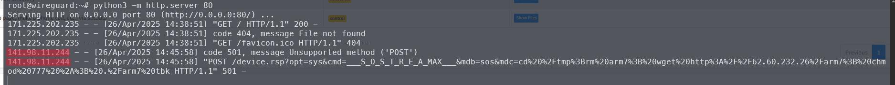
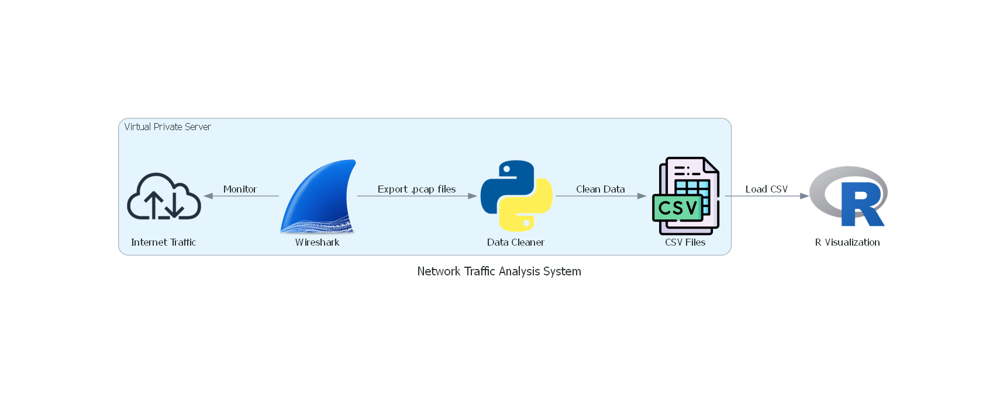

# COMP4010 Project 2 - Virtual Private Cloud Network Visualization 

This project showcases the ability of R to do active & real-time network monitoring in virtual private server (VPS). 

## Members

+ Nguyen Tuan Anh
+ Tran Tat Hung
+ Truong Dang Gia Huy

## Introduction 

With the blooming of cloud services around the world, Virtual private server (VPS) are increasingly popular among developers or whoever interested in self-hosting something that help & comfort their daily digital lifes. Personal websites, game server, and even self-hosted virtual private network (VPN) are all hosted in personal cloud instance. This makes the life of digital nomads, developers, and even start-ups around the world much more simpler by not necessarily having an expensive server rack in their home or office. 

However, virtual private cloud is facing a crutial and also sadly fact: they are very rewardful targets to cybercriminal. With the VPS's public IP, which is easy to get from DNS records of the cloud services, attackers can easily scan for opening services by tools like [nmap](https://nmap.org/), and even deploying automatic exploits. For example, just opening a simple HTTP server, within 5 minutes, we got "visit" from a friend in... Lithuania? 

From these actively running vulnerability scanners, cyber attacks could deploy thousands forms of attacks:

- Ransomware
- Cryptominer
- Botnet for future Distributed Denial-of-service attacks
- ... many many more :(

One of our teammate faced an [incident](https://h114mx001.netlify.app/posts/how-we-got-hacked-while-ctfing/) before, where his team got hacked by cybercriminal, got a cryptominer run intensively in their clusters, just because they did not secure their network, with assumption in mind is **only they can access the VPS**. 

From this inspiration, we selected this project: using open-source network monitoring tool [Wireshark](https://www.wireshark.org/), combining with the power of R in informative visualization, to provide a dashboard of active threats against VPS, from evil outsiders.

## Objectives

1. Showing a proof-of-concept on how visualization could help in network monitoring using `flexdashboard` and `shiny`.
    - When during the day does malicious traffic spike? - A time-series line chart of `packet counts` and another time-series line chart of `length`, both have time interval input (1D, 7D, 30D)
    - Which countries are hitting my VPS the most right now? A choropleth on world map show `source_country` and `length` with metric switch (by count or total bytes), with time interval input (1D, 7D, 30D)
    - What are the top `source_ip` and their detailed traffic over time? – A horizontal bar chart showing top `source_ip` by total traffic, with a Top-N dropdown (Top 5, Top 10, Top 20) and a `protocol` filter dropdown. Click on a bar to show a table below with all packets from that IP over time (including `timestamp`, `protocol`, and `length`)

2. Raising the awareness of people on the current threat scenario, as well as putting security of the virtual private cloud in mind.

## Data Gathering & Setup 

We will use our teammate's virtual private server as the data source for this project. The design of the data retrieving system can be explained with this figure: 

+ We will use Wireshark, an open-source network monitoring tool to monitor our network. 
+ Next, we will export the inbound traffic of our virtual private cloud into JSON. This will be the input for the Python data cleaner ultilities to clean the data & enrich the information about location of the income IP address. 
+ These information will then be written in a Redis key-value database store, for the FastAPI server to query.
+ Our FastAPI backend server will exposes the APIs for client R code.

Also, because this project is aimed to show how "reachable" our virtual private server to the attackers server, a list of IPs which we are using **will be excluded in the data gathering**.

## Data Dictionary 

For the visualization of the R code, we will use the following table schema, where each row is a single network packet. 

|variable                  |class     |description                           |
|:-------------------------|:---------|:-------------------------------------|
|timestamp                 |integer   |UNIX timestamp of the trafifc |
|source_ip                 |string    |IPv4 address of Source |
|source_country            |string    |The country where source_ip comes from, based on geolocation |
|destination_port          |integer   |The destination port that `source_ip` connects to. |
|protocol                  |string    |Protocol used by the packet | 
|length                    |integer   |Length in bytes of the packet |

The example of upcoming CSV is in [here](./src/parser/output.csv).

## Plan

### Infrastructure Setup

- [x] Set up Wireshark on the VPS for traffic capture
- [x] Set up Redis database to store processed data

### Visualization

- [ ] Build dashboard with time-series charts for traffic monitoring
- [ ] Create interactive world map showing traffic by country
- [ ] Implement top talkers bar chart with filtering options
- [ ] Add click-through functionality for detailed packet analysis

## Presentation and Report
